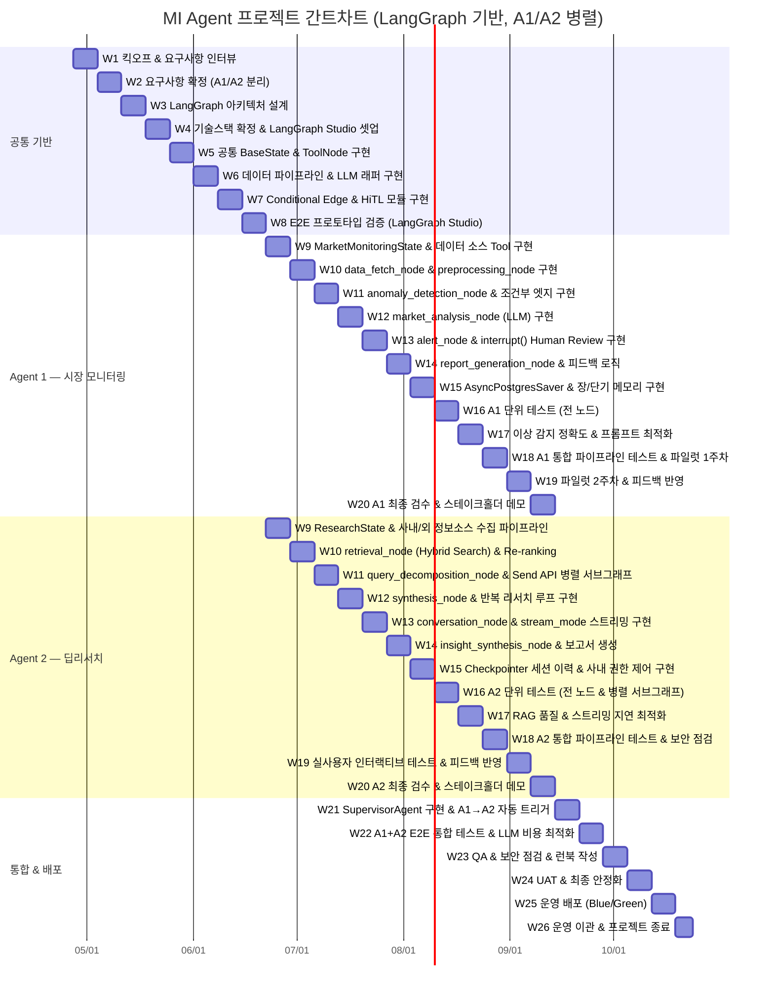
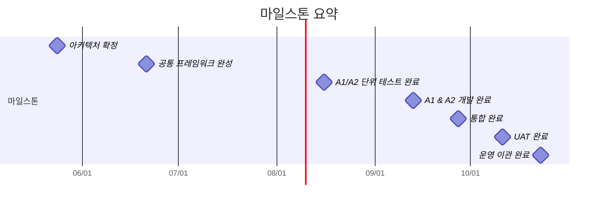

# MI Agent 프로젝트 간트차트 (6개월)

> 기간: 2026-04-27 ~ 2026-10-23 (26주)  
> 기술 스택: LangGraph | 개발 방식: Agent 1 / Agent 2 팀 **병렬 진행** (W9~W20)

---

## 간트차트



---

## 마일스톤 타임라인



---

## 팀 구성 및 병렬 구조 요약

```
W1  ──── W8  : 전체 팀 공통 작업 (기획 + 공통 인프라)
                        │
              ┌─────────┴─────────┐
              ▼                   ▼
W9  ──── W20 : [A1 팀]          [A2 팀]
              시장 모니터링       딥리서치
              에이전트 개발       에이전트 개발
              └─────────┬─────────┘
                        │
W21 ──── W22 : 통합 (Supervisor 패턴, A1↔A2 연동)
W23 ──── W24 : QA / UAT / 안정화
W25 ──── W26 : 운영 배포 & 이관
```

---

## 주간 병렬 작업 현황 (W9~W20)

| 주차 | A1 팀 (시장 모니터링) | A2 팀 (딥리서치) |
|------|----------------------|----------------|
| W9  | MarketMonitoringState & 데이터 소스 Tool | ResearchState & 정보소스 수집 파이프라인 |
| W10 | data_fetch / preprocessing 노드 | retrieval_node (Hybrid Search) |
| W11 | anomaly_detection + 조건부 엣지 | query_decomposition + Send API 병렬 서브그래프 |
| W12 | market_analysis_node (LLM) | synthesis_node + 반복 리서치 루프 |
| W13 | alert_node + interrupt() Human Review | conversation_node + stream_mode 스트리밍 |
| W14 | report_generation + 피드백 로직 | insight_synthesis + 보고서 생성 |
| W15 | AsyncPostgresSaver + 장/단기 메모리 | Checkpointer 세션 이력 + 사내 권한 제어 |
| W16 | A1 전 노드 단위 테스트 | A2 전 노드 + 병렬 서브그래프 단위 테스트 |
| W17 | 이상 감지 정확도 & 프롬프트 최적화 | RAG 품질 & 스트리밍 지연 최적화 |
| W18 | A1 통합 테스트 + 파일럿 1주차 | A2 통합 테스트 + 보안 점검 |
| W19 | 파일럿 2주차 + 피드백 반영 | 실사용자 테스트 + 피드백 반영 |
| W20 | A1 최종 검수 & 데모 | A2 최종 검수 & 데모 |

---

*최종 업데이트: 2026-04-25 | LangGraph 기반 병렬 개발 구조*
